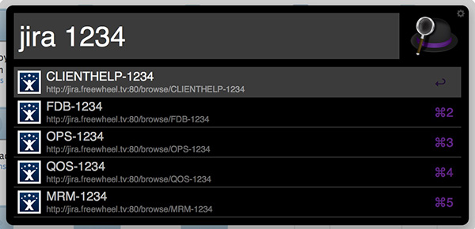
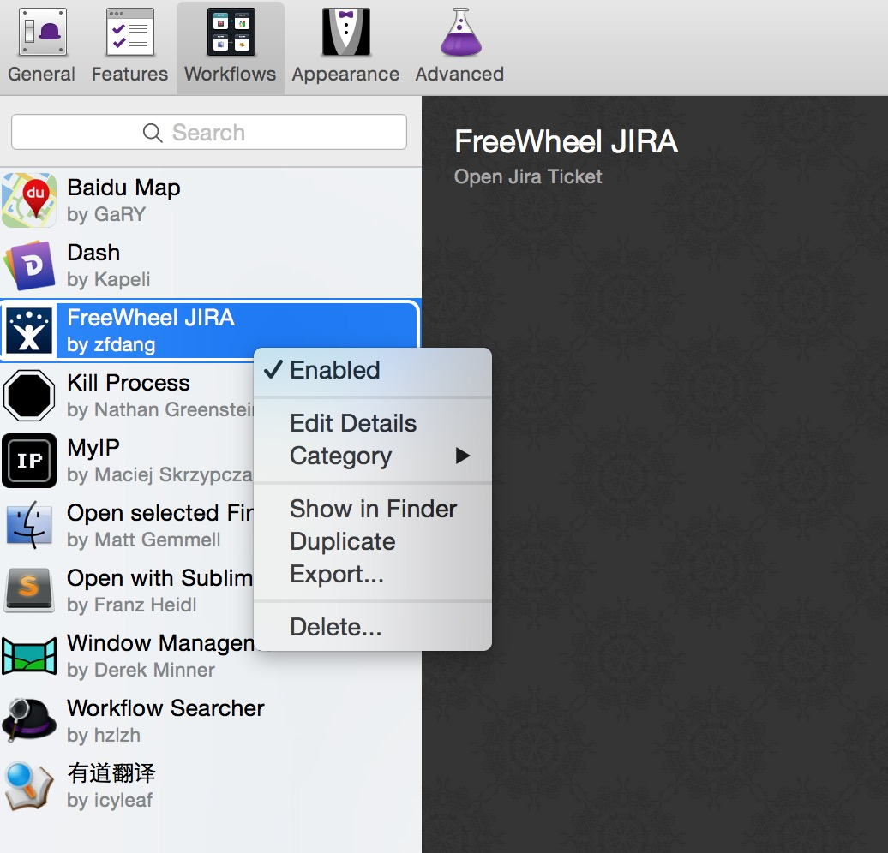

# Alfred JIRA Workflow

this workflow allows you to open JIRA ticket by inputing ticket number directly.

Alfred > jira 1234

All possible tickets will be shown, and you can select any of them and open it in default browser.

## Step.1 Install workflow to your Alfred

just double click file "FreeWheel JIRA.alfredworkflow" to install it 

## Step.2 Configure workflow to point to your JIRA system

Alfred --> Prefereces --> Workflow --> FreeWheel JIRA

--> Select "Show in Finder" in Right-click Menu

Edit PROJECTS in jira.py file:

> PROJECTS = ["http://jira-old.freewheel.tv/browse/CLIENTHELP",
>             "http://jira-old.freewheel.tv/browse/MRM",
>             "http://jira-old.freewheel.tv/browse/FDB",
>             "http://jira-old.freewheel.tv/browse/QOS",
>             "http://jira.freewheel.tv/browse/INK",
>             "http://jira.freewheel.tv/browse/OPP",
>             "http://jira.freewheel.tv/browse/ESC",
>             "http://jira.freewheel.tv/browse/OPS"]

Save it.

## Step.3 Open JIRA ticket in Alfred with keyword "jira"

done.

